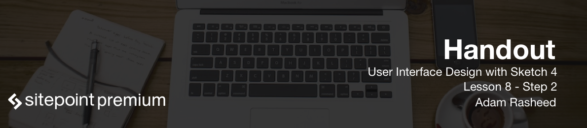

Now we will discuss the new text transform tool available in the Sketch 40 update. Text transform is originally a CSS property. It allows you to change the actual font to uppercase or lowercase, all within the styles. So you don't have to actually change the actual markup over again when you want all your buttons or whatever to change from lowercase to uppercase and vice versa.

In Sketch you can go to options and find the new text transform feature. Here you can choose lowercase or uppercase or none.