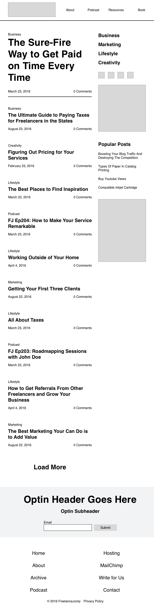

# Creating a Tablet Wireframe
In this video, we'll use our mobile wireframe and adapt it to an extended tablet screen size.

The main difference in terms of layout is that we'll bring the sidebar content to the side, next to the blog posts. Furthermore, we'll also expand the navigation so that you can see the menu links without having to click a menu button.

