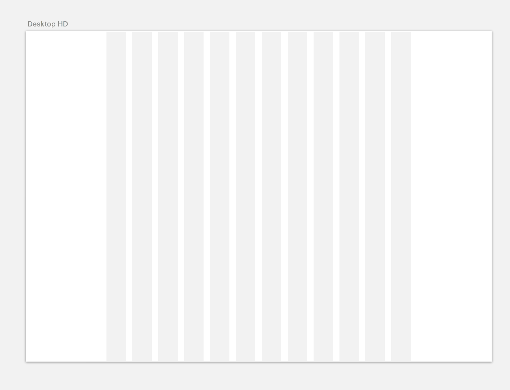

# Sketch Overview
A quick overview of Sketch 3, the UI software we’ll be using for this course.

### Getting Around
Sketch has a very user-friendly, intuitive interface. The bst way to get used to it is to play aaround with it and get a feel for all the features of the layouts: Inspector, Layers List, Toolbar.

### Artboards
Artboards are the canvases on which you can crete your 

### Pages
Pages are useful for creating different pages on your website, styleboards, etc. 

### Inspector Tool
Inspector tool is one of the best things about Sketch. Here is where you;ll find tools that allow you to chagnes things like position, size, opacity, and blending mode. It also includes tools like shared style manager, shadow managers, and much more.

### Grids & Layouts
A great improvement of Sketch over Photoshop for UI design is that Sketch includes a layout tool that allows you to quickly create layout columns and grids for visually appealing design.

### Plugins
Plugins allow you to extend the capabilities of Sketch with things like, measuring anntations, creating dummy content, and even prototyping. 
