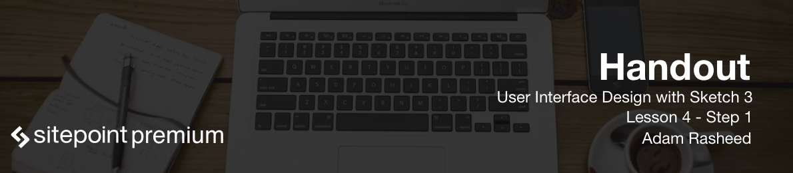
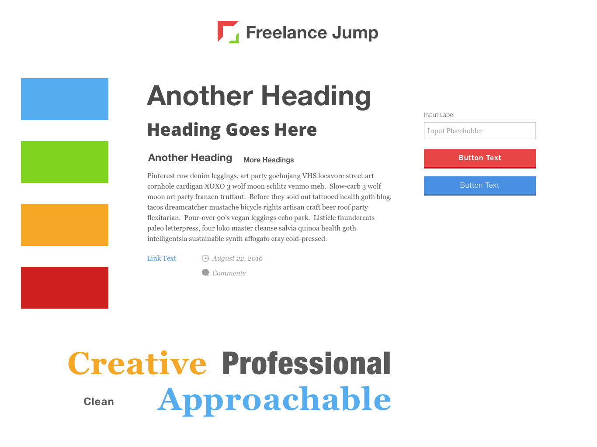

# Style Tiles
A Style Tile is like a Style Guide without all the fuss.

It helps you figure out the look and feel of your design, the "visual ingredients" of your design.
A style tile is an in-between solution between a moodboard and a full-blown style guide.

Moodboard → Style Guide → Mockup

**Consists of:**
- Fonts
- Colors
- Patterns / Textures
- Adjectives
- Buttons/ Design Elements

## Project Style Tiles

Here is the style tile for the FreelanceJump redesign. As you can see, it's much more simple than the description above. There are a handful of objectives, a color palette, font families and sizes, and a couple of buttons.

### Colors 

Here are the exact colors I'm using for the project:

- Text:   #4A4A4A
- Light Text: #9B9B9B
- Blue:   #55ACEE
- Dark Blue: #3B73B4
- Green:  #7ED321
- Red:    #CD201F
- Dark Red: #D0021B
- Orange: #F5A623

**Resources:**
- http://styletil.es
- http://alistapart.com/article/style-tiles-and-how-they-work

