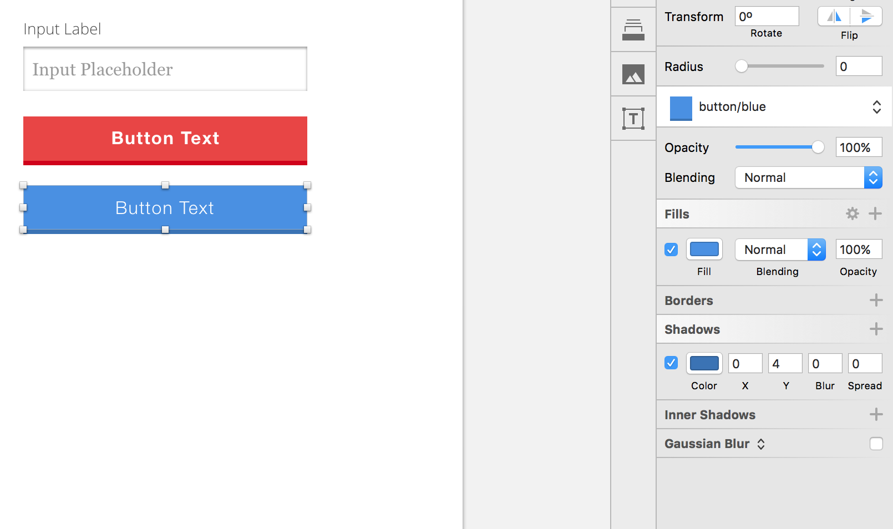

#Creating Buttons and Forms

In this lesson we're gonna be creating some buttons and forms for our style tile. 

Give a border for the input, set it to `#4A4A4A`, set thickness to 1. Add an inner shadow - the default one is fine for now.

Next style button.

So to recap in this lesson, we created our typography which is our headings, our body text, our link, our metatext and our place holder. Our button texts and our labels. And after that we picked our colors, after which we picked our icons and lined up the colors for our metatags.

And we also picked up the correct brand colors for our social media icons. And finally, we created these buttons and forms. Now, before we move on, I just want to make sure everything is grouped up just to keep things organized, and now is our moment of truth in the next lesson.

