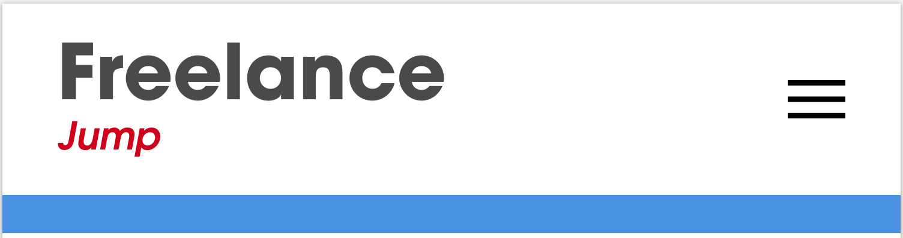

#Designing the Header for Mobile

This is going to be the core lesson, and where we're gonna be designing a majority of the user interface for our blog. And just like we did with our wire framing, we're gonna start off with a mobile first approach, that means we're gonna design for our mobile screen size first, and then move on to tablet and desktop later.

Open up the Sketch file and go down to pages and add a new one called home page. Create an iPhone 6 artboard. Increase width to 376px.

Open the course folder that can be download by clicking a button underneath the video. Go into assets go down to logo and open that up and go to phone.svg.

Next place hamburger icon.

