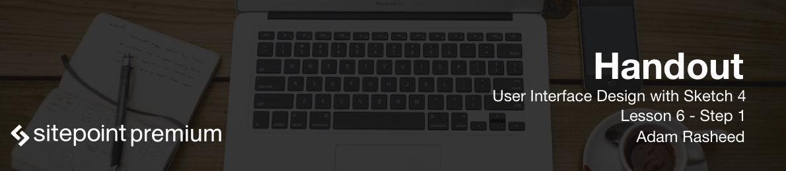
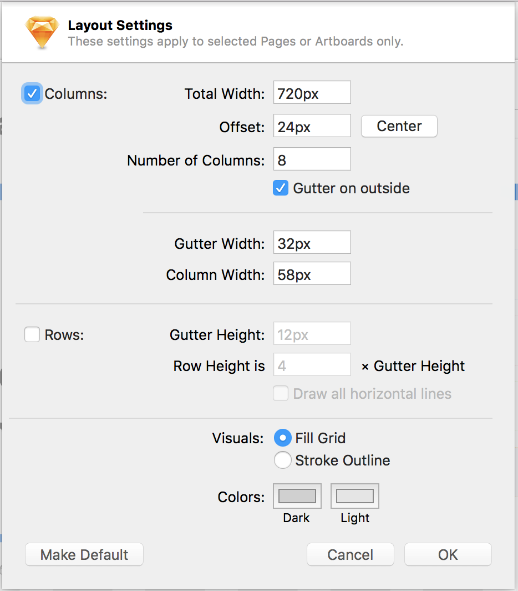
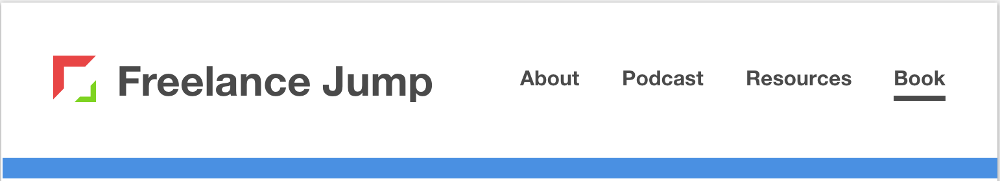
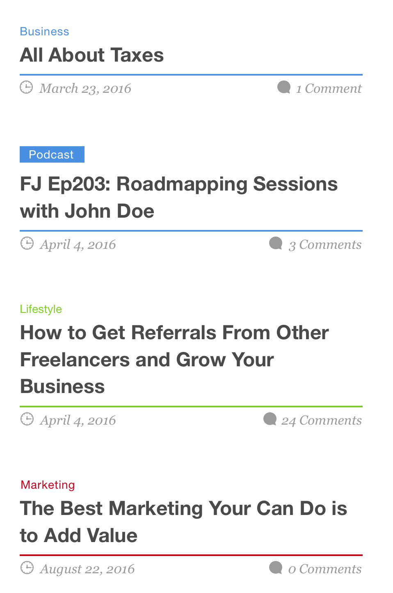
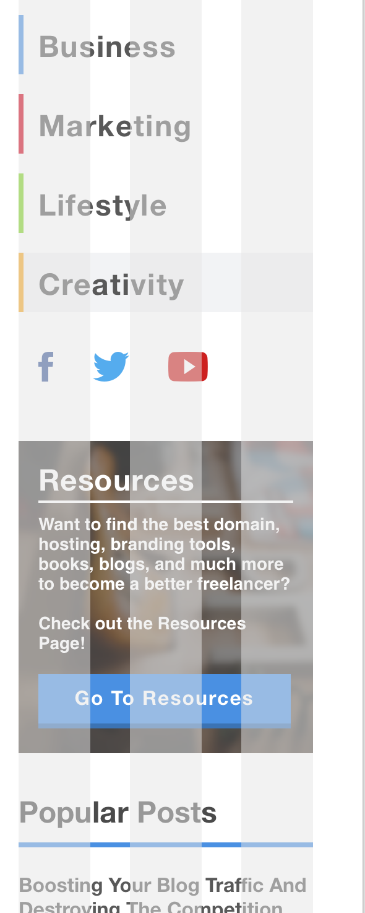
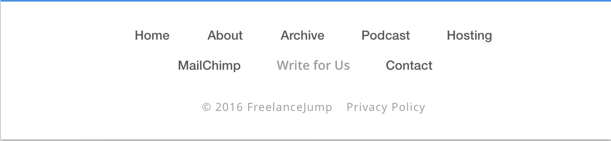

# Designing the UI for Tablet

Now that we have out design for mobile, we'll use it to create a design for a tablet view.

### Artboard
Start by pressing "A" to open up the artboard menu, and click on iOS Devices > iPad Portrait and rename it "Home-Tablet". Next, open up Layout settings, and change them to the following:

- Total Width: 720px
- Offset: center
- Columns: 8
- Check on Gutter on Outside
- Gutter Width: 32px
- Allow Column Width to auto-calculate.

### Header
Because of the wider screen size of a tablet, we'll be able to expand the menu to show all the navigation links without having to click on a menu button. We'll start by pasting in the "logo-tablet" SVG from your assets folder in, and align it on the edge of the left-most column. 

For the Menu, we'll create text layers with a bold wieght and 16px font size, and create a text style called "Menu-Link". We'll use this style to create a total of 4 navigation links, space out 32px from each other. On the last link, we'll create a 4px high rectangle underline with the same color as our text color, and space it 5px underneath the link. This will show the developer of what a hover state will look like. Then, we'll create a thicket banner of 16px, and a style of banner to it and palce it 40px under our header. Lastly, select these elements and group them into a group called "Header".

### Blog
This tablet screen size will introduce a new layout where the content areas will move to the right of the blog area, and the footer content will be at the bottom. Given our 8 column layout, the blog will take up 5 columns, and the sidebar content will take up 3. We will simply copy the blog content from the mobile screen art board and paste it in here to save us time. Obviously, we will need to make some adjustments.

#### Featured Post
We'll now need to make our featured post a little more prominent. We'll do this by increasing the size of the headline to 48px, and creating a new text style from it called "H1-Mega/Tablet". We'll also increase the distance between the top category and the underline banner below to 16px each.

#### Normal Posts
Adjusting the normal posts will be a relatively easy task. All you need to do is to increase the width of the headlines and the underline banners to 418px so that they fill up exactly 5 columns, next, you'll need to postion the comments meta tags over to the edge. Repeat this for all the blog posts. Additionally, since we now have more space, we can increase the nubmer of our blog posts to 10, not counting the featured post.

#### Load More
We'll increase the width of our load more button to 3 columns wide, and increase the distance between the last blog post to 96px.

### Sidebar
We'll adjust the siebar jsut like how we adjested the blog posts. We'll adjust the container of the individual groups, and make sure everything lines up, and create it into a new symbol named "Sidebar/Tablet"

### Email Optin
We'll widen the email optin so it's 100% of the artboard width, increase the headline size to 48px, and move the submit button from below to the right of the email input, making sure they line up with the columns.

### Footer
For the footer we simply need to reposition the links so they're centered.

