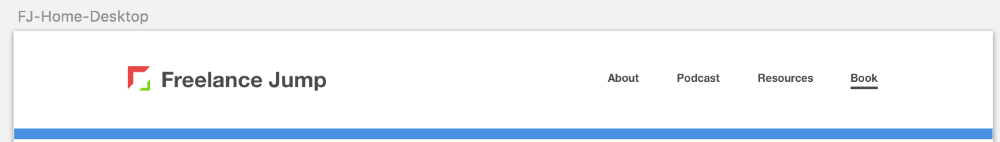
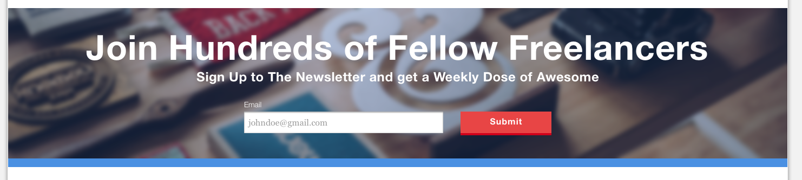
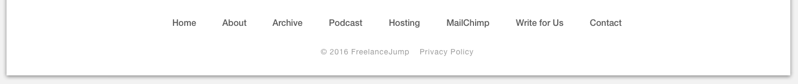

# Designing UI for Desktop

Now that we've designed the UI for both mobile and tablet screen sizes, we're going to design for a much wider desktop screen size. The main difference between the tablet and desktop versions will be that in the desktop version, the blog area will me wider and split up into two seperate columns.

## Artboard
Create an artboard by pressing "A" and clicking Responsive Web Design > Desktop HD
Change the layout settings to following:

## Header
For the logo, use the "Logo-Desktop" SVG from your assets folder and use it for the desktop screen size. 

## Blog
For the desktop screen size, we'll split the blog articles into a two column layout. The featured post, however, will take up a full-width area. The featured content will take up 8 columns total, and the headline size should be increased to 64px and the new text style created should be named "H1-Mega". The normal blog articles should be 4 columns wide each.

The Load more button should also be widened.

## Sidebar
The sidebar should be adjusted to take up 4 columns in this widened layout and created into a new symbol called "Sidebar-Desktop"

## Email Optin
The email optin should also be widened to 100% of the artboard width.

## Footer
The footer links should be spaced apart into a single row.

This is what the end result should look like:
