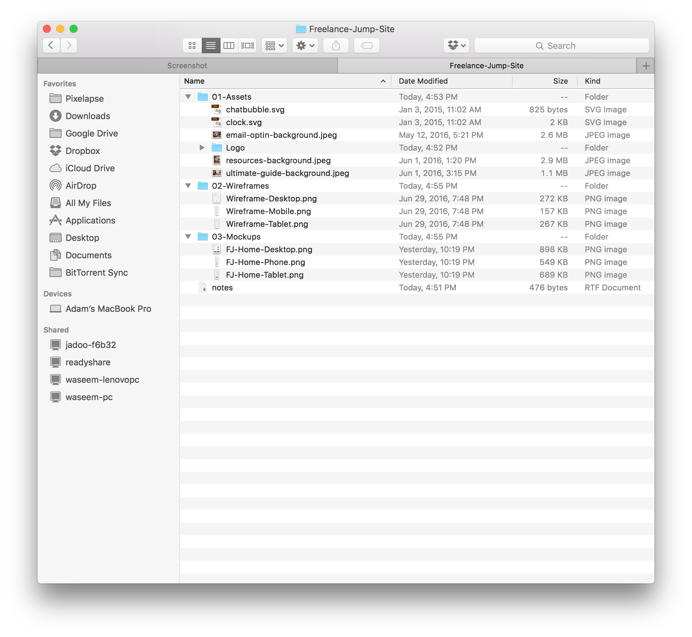

# Preparing Deliverables

In this video, you'll learn how to prepare Sketch files and export assets to deliver to clients.

## Exporting Assets
A great benefit of Sketch is that it lets you easily export assets to use for development.
The most recommended assets that you should export are:
- Icons
- BLurred Background Image
- Vector shapes (i.e. logos)

Note: Export in an SVG whenever possible, if not, export in 1X, 2x, and 3x.

## Export Folder
It's recommended that you deliver your project in a zipped folder that includes:
- The Sketch document
- Exported assets
- Text document Notes about for the devloper (e.g. fonts in use, hover states, etc.)

This is how the project folder for our site looks like: 

